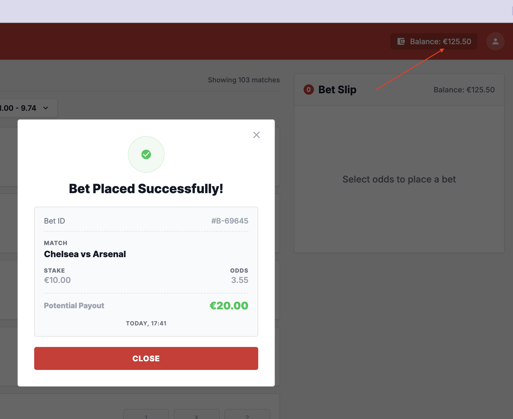
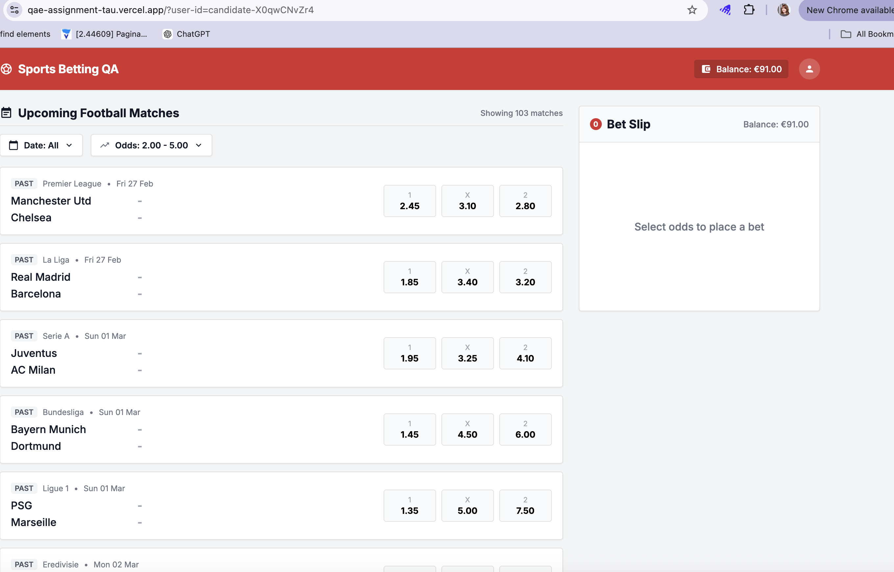

# Bug Reports

## BUG-001 — Account balance does not update after successful bet placement

Severity: Critical

Reproduction Steps:

1. Log in as a user with the default starting balance €125.50.
2. Select an upcoming match, click "1" odds (e.g., 2.50).
3. Enter stake 10.00 and click "Place Bet".
4. Wait for the success receipt, then close it.
5. Observe the balance in the header.

Expected vs Actual:

- Expected: balance shows €115.50 (€125.50 − €10.00).
- Actual: balance still shows €125.50. Refreshing the page corrects it to €115.50.

Business Impact: Users see stale balances, may attempt bets they can't afford, and lose trust in the platform's financial accuracy.

Evidence:

---

## BUG-002 — Odds filter does not apply: match list remains unfiltered

Severity: High

Reproduction Steps:

1. Navigate to the match list (containing matches with odds across a wide range).
2. Open the odds filter.
3. Set Min = 2.00, Max = 5.00 and Apply.
4. Observe the match list.

Expected vs Actual:

- Expected: only matches with at least one odds value in [2.00, 5.00] are displayed.
- Actual: full unfiltered list remains; matches with odds 1.00 and 10.00 are still shown. No error message.

Business Impact: Users cannot narrow matches to their preferred odds range, harming bet discovery and reducing placement volume.

Evidence:

---

## BUG-003 — Potential payout on success receipt differs from bet slip

Severity: Critical

Reproduction Steps:

1. Select a match with "1" odds = 2.50 and enter stake 10.00.
2. Note the bet-slip potential payout: €25.00.
3. Click "Place Bet" and wait for the success receipt.
4. Read the "Potential Payout" field on the receipt.

Expected vs Actual:

- Expected: "Potential Payout" in the Bet Slip is the same as in the receipt.
- Actual: "Potential Payout" in the Bet Slip is different from the receipt. Confirmed across multiple stake/odds combinations.

Business Impact: Customers see conflicting payout figures at the point of transaction, triggering support tickets, financial disputes, and regulatory complaint risk.
